# Testlauf 10.10.2026, 14:43 Uhr

- Datum: 10.10.2026, 14:43 Uhr
- Tester: Dave
- Gerät: Laptop
- Ember-Version: v0.4.0-9-g3cddbef (git)

## Zusammenfassung

- 41 von 41 erledigt, 0 offen
- O (ok): 15 · X (Fehler): 0 · Eigen: 26
- Bilder: 23

## Vorbereitung

- [O] `node -v` zeigt eine LTS-Version (20 oder neuer): ______
- [O] `git pull` im Ember-Ordner, keine Fehlermeldung
- [O] Größe von `data\ember.json` notiert: ______ KB — Notiz: 1
- [Eigen] Alte Ember-Tabs und -Fenster in allen Browsern geschlossen — Notiz: Hab hier für auch die Umgebungen mit Dokumentiert
- [Eigen] Konsole: QuickEdit aus (Fenster → Eigenschaften) oder Start über `Ember.bat` (minimiert) — Notiz: Hab Github Desktop oder VSStudio oder Notepad++ was Edit in Allen Fenstern/Desktops. Ember.bat scheint obssolete.
- [Eigen] Uhrzeit beim Start notiert: ______ — Notiz: Hab um 13Uhr angefangen. (BEMESSE TROTZDEM TIMER PRO CHECKLISTEN PUNKT)

## Start

- [Eigen] `start.bat`: Zeit bis `/ember` am PC lädt: ______ s — Notiz: 3 - 5 sek im schnitt. bin 10 mal durch immer gleich
- [Eigen] Tunnel-Adresse erscheint in der Titelleiste nach ______ s (keine alte Adresse vom letzten Mal) — Notiz: nach dem zünden von Ember. Nie mehr 2-6sek. auch 10mal getestet
- [Eigen] `data\tunnel.log`: keine Zeilen „Failed to dial a quic connection“, Protokoll http2 — Notiz: nichts zu finden
- [Eigen] Erststart: `data\sl.pin` enthält die eingegebene PIN (nicht „ECHO ist ausgeschaltet“) — Notiz: Leider steht dort genau das. Hab nen Bild hinterlegt

## PC-Seiten

- [O] `/` Startseite lädt, Kacheln klickbar
- [Eigen] `/ember` Spielleitung lädt, Session starten geht — Notiz: BITTE IN DIE FOTO SERIE GUCKEN. ich weis nicht wieso ab dort nichts mehr funktioniert.
- [O] `/token` Tokenatelier lädt
- [O] `/pixelstube` zeichnen, PNG speichern, 5× schnell neu laden: kein Absturz
- [O] Mediathek: Video abspielen, vor- und zurückspulen
- [O] Mediathek: kleines Video (< 50 MB) hochladen, Prozentanzeige läuft
- [O] Mediathek: großes Video (> 1 GB) am PC hochladen, danach abspielen und spulen
- [O] `/heft` neue Notiz, löschen, „Rückgängig“; Editor füllt die ganze Höhe
- [Eigen] `/solo` ohne Bogen: Hinweis „Noch kein Bogen“, Knöpfe aus — Notiz: ab Solo werkstatt dunktionieren buttons nicht.
- [Eigen] `/solo` mit Bogen: Solo öffnen, Bot setzen, Bot zieht, Meldungen oben sichtbar — Notiz: Ansich finde ich es cool aber komm an settings nicht ran
- [O] `/bibliothek` zeigt DH-SRD (öffnet als PDF) und die Karten
- [O] `/karten` lädt
- [O] Einstellungen (Startseite): Schrift/Kacheln ändern, bleibt nach Neuladen
- [Eigen] Ereignis-Seiten: `/runner`, `/fallwerk`, `/pastellpfad`, `/scharfschuss`, `/puls` laden — Notiz: Wo finde ich die?

## Spieler lokal (LAN)

- [Eigen] `http://<PC-IP>:3478/player` am Handy/TV: Ladezeit ______ s — Notiz: Hab in der Fotoserie drauf zu achten wann, was passieren sollte. Bitte nachsehen
- [Eigen] Profil anlegen, mit PIN eintreten, Bogen wählen — Notiz: Hab in der Fotoserie drauf zu achten wann, was passieren sollte. Bitte nachsehen. Scheint eh obsolete zu sein... ich meine Als Admin gebe ich nicht mein gerät ab wo auch der server selbst läuft.
- [O] Würfeln, SL sieht den Wurf im Log

## Spieler von außen (Handy-Hotspot über Tunnel)

- [Eigen] Tunnel-Adresse `/player`: Ladezeit ______ s — Notiz: - NULL: nicht diesmal
- [Eigen] Profil + PIN eintreten — Notiz: - NULL: nicht diesmal
- [Eigen] Würfeln, SL sieht den Wurf nach ______ s — Notiz: - NULL: nicht diesmal
- [Eigen] Sitz-Punkt beim SL wird grün/grau, wenn der Spieler kommt/geht — Notiz: - NULL: nicht diesmal

## Mehrere gleichzeitig

- [Eigen] PC (`/ember`) + TV (`/player`) + Handy (`/player`) gleichzeitig offen — Notiz: - NULL: nicht diesmal
- [Eigen] Am PC 4+ Ember-Tabs offen: neue Seiten laden weiter, Würfe kommen an — Notiz: - NULL: nicht diesmal
- [Eigen] Ein Gerät lädt neu: die anderen laufen weiter — Notiz: - NULL: nicht diesmal

## Sicherheit (über die Tunnel-Adresse, nicht am PC)

- [Eigen] `<Tunnel>/api/sl-pin` → „Nur dieser Rechner.“ (keine PIN) — Notiz: - NULL: nicht diesmal
- [Eigen] `<Tunnel>/api/profiles` → „Nur dieser Rechner.“ — Notiz: - NULL: nicht diesmal
- [Eigen] Neustart / Update von außen → abgelehnt — Notiz: - NULL: nicht diesmal

## Störfälle

- [O] Seiten schnell hintereinander neu laden: Server läuft weiter
- [Eigen] Tunnel-Fenster schließen: PC-Seiten laufen weiter, Spieler von außen sehen Fehler — Notiz: - NULL: nicht diesmal
- [Eigen] Server neu starten (Knopf oder Strg+C und `start.bat`): Seiten verbinden sich wieder — Notiz: Würde gerne diesen bereicht abwarten. wegen wenn ich über einstellungen fetch gebe ich meine antwort
- [Eigen] `data\crash.log` geprüft: leer / Einträge: ______ — Notiz: - NULL: nicht diesmal

## Bilder

### 1. 000. BACK_DESKTOP - Mein Anfang der Dokumentation.png

- Datei: `bilder/01_000-back-desktop-mein-anfang-der-dokumen.png` (Original: 000. BACK_DESKTOP - Mein Anfang der Dokumentation.png)

### 2. 001. BACK_DESKTOP - Explorer Windows - Fetch war erfolgreich.png

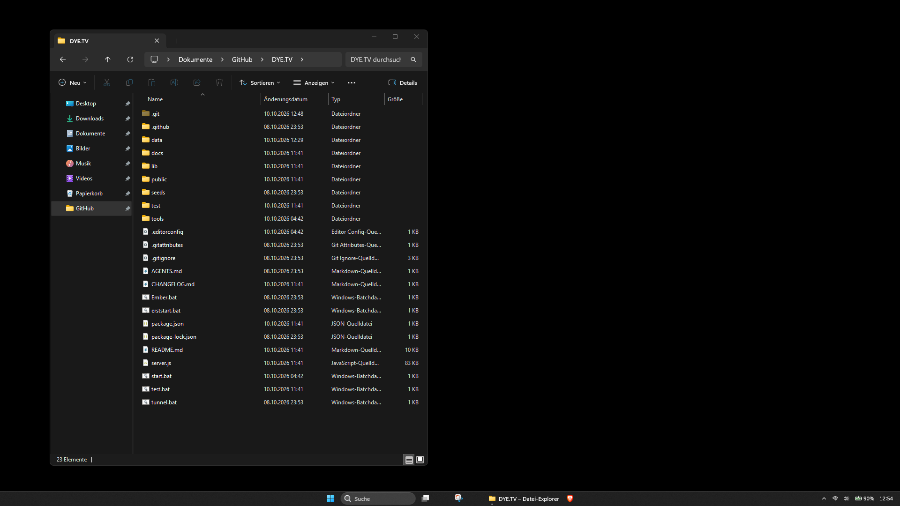

- Datei: `bilder/02_001-back-desktop-explorer-windows-fetch.png` (Original: 001. BACK_DESKTOP - Explorer Windows - Fetch war erfolgreich.png)

### 3. 002. BACK_DESKTOP - Explorer Windows & Terminal von (start.bat).png

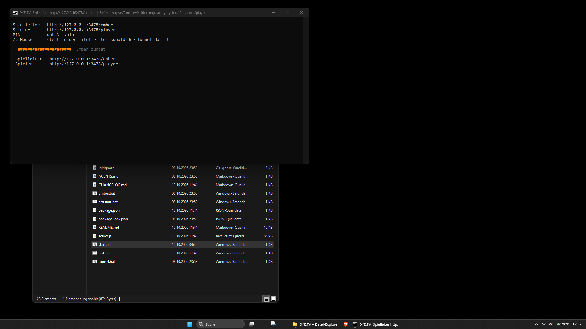

- Datei: `bilder/03_002-back-desktop-explorer-windows-termin.png` (Original: 002. BACK_DESKTOP - Explorer Windows & Terminal von (start.bat).png)

### 4. 003. FRONT_DESKTOP - Neu erstellt.png

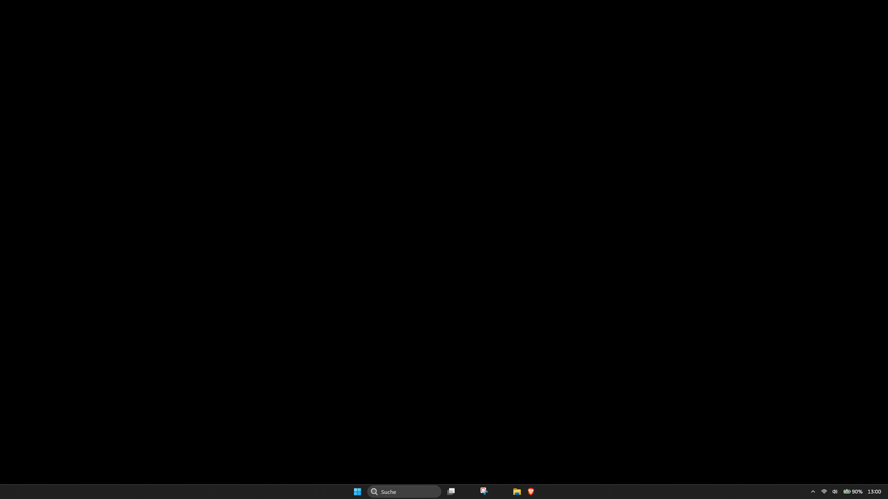

- Datei: `bilder/04_003-front-desktop-neu-erstellt.png` (Original: 003. FRONT_DESKTOP - Neu erstellt.png)

### 5. 004. FRONT_DESKTOP - Öffne Browser Brave.png

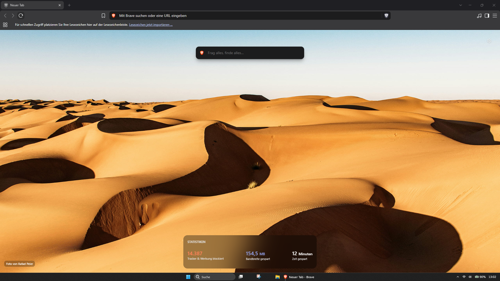

- Datei: `bilder/05_004-front-desktop-oeffne-browser-brave.png` (Original: 004. FRONT_DESKTOP - Öffne Browser Brave.png)

### 6. 005. FRONT_DESKTOP - Browser Brave - Öffne URL; 127.0.0.1;3478.png

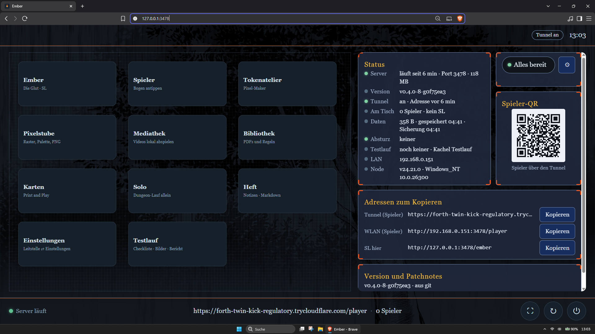

- Datei: `bilder/06_005-front-desktop-browser-brave-oeffne-u.png` (Original: 005. FRONT_DESKTOP - Browser Brave - Öffne URL; 127.0.0.1;3478.png)

### 7. 006. FRONT_DESKTOP - Browser Brave - Gehe in Testlauf.png

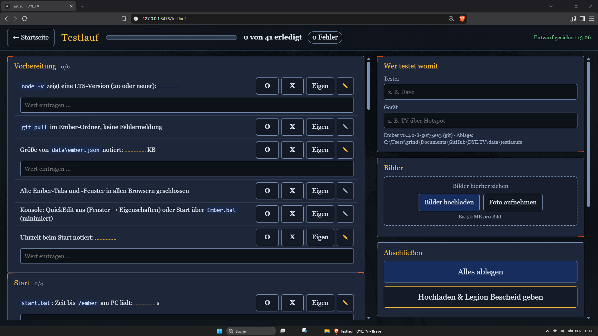

- Datei: `bilder/07_006-front-desktop-browser-brave-gehe-in.png` (Original: 006. FRONT_DESKTOP - Browser Brave - Gehe in Testlauf.png)

### 8. 007. FRONT_DESKTOP - Browser Brave - Öffne neuen Tab.png

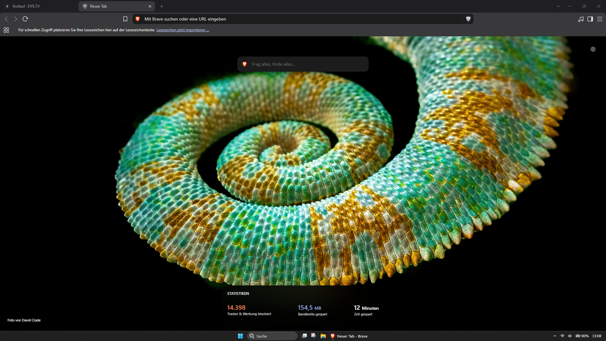

- Datei: `bilder/08_007-front-desktop-browser-brave-oeffne-n.png` (Original: 007. FRONT_DESKTOP - Browser Brave - Öffne neuen Tab.png)

### 9. 008 - FRONT_DESKTOP - Browser Brave - 2tes mal URL geöffnet.png

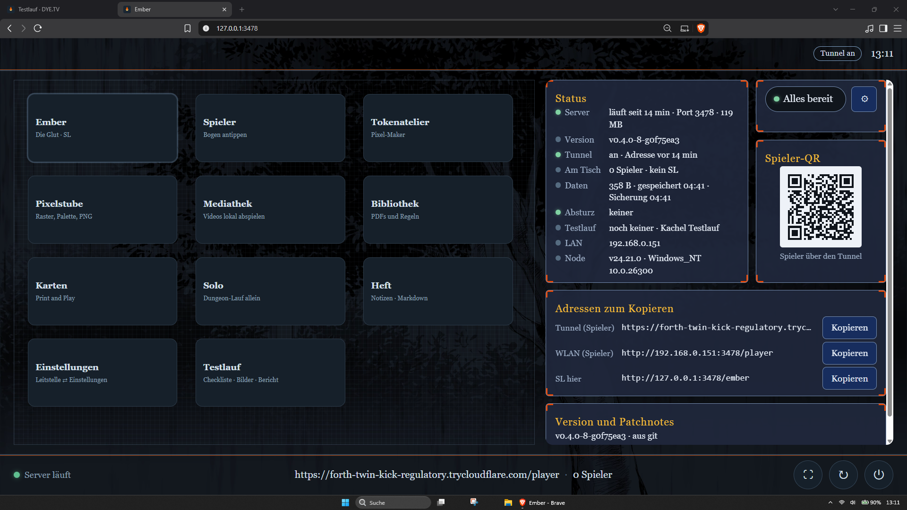

- Datei: `bilder/09_008-front-desktop-browser-brave-2tes-mal.png` (Original: 008 - FRONT_DESKTOP - Browser Brave - 2tes mal URL geöffnet.png)

### 10. 009 - FRONT_DESKTOP - Browser Brave - Testlauf; Vorbereitung 1 - Beweis.png

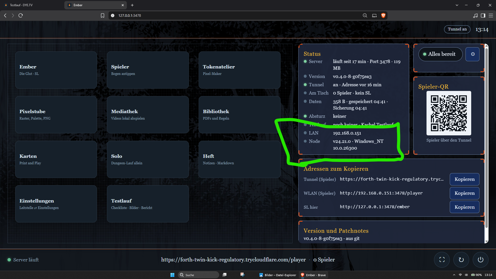

- Datei: `bilder/10_009-front-desktop-browser-brave-testlauf.png` (Original: 009 - FRONT_DESKTOP - Browser Brave - Testlauf; Vorbereitung 1 - Beweis.png)

### 11. 010. BACK_END - Explorer Windows Terminal DYE.TV Shell - Vorbereitung 2 - Beweis.png

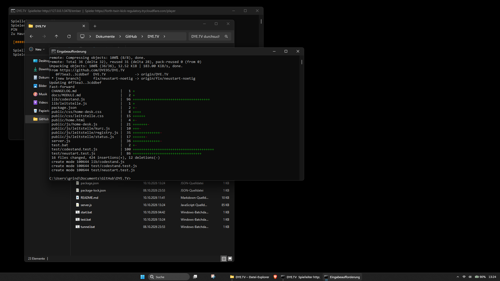

- Datei: `bilder/11_010-back-end-explorer-windows-terminal-d.png` (Original: 010. BACK_END - Explorer Windows Terminal DYE.TV Shell - Vorbereitung 2 - Beweis.png)

### 12. 011. BACK_DESKTOP - Explorer Windows - Vorbereitung 3 - Beweis.png

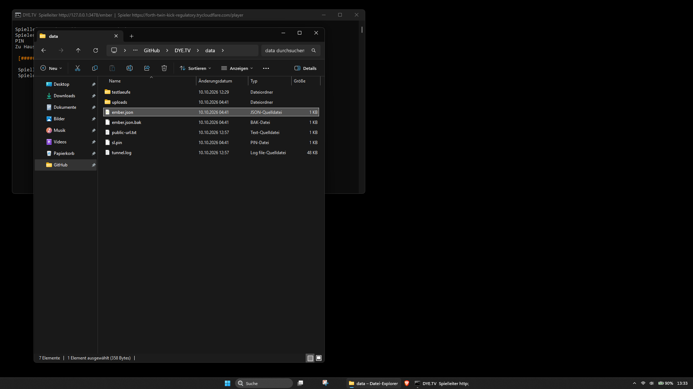

- Datei: `bilder/12_011-back-desktop-explorer-windows-vorber.png` (Original: 011. BACK_DESKTOP - Explorer Windows - Vorbereitung 3 - Beweis.png)

### 13. 012. FRONT_DESKTOP - Browser Brave - Vorbereitung 3&4 - Beweis.png

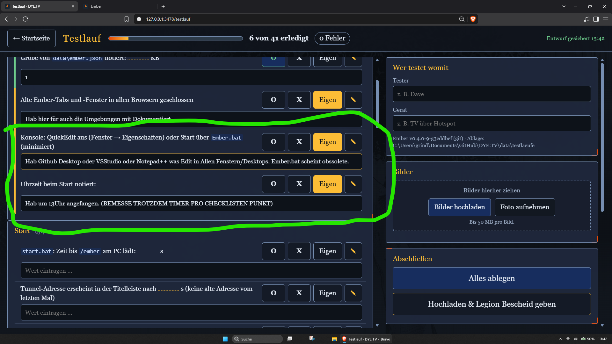

- Datei: `bilder/13_012-front-desktop-browser-brave-vorberei.png` (Original: 012. FRONT_DESKTOP - Browser Brave - Vorbereitung 3&4 - Beweis.png)

### 14. 013. BACK_DESKTOP - Notepad++ - Start 3 - Beweis.png

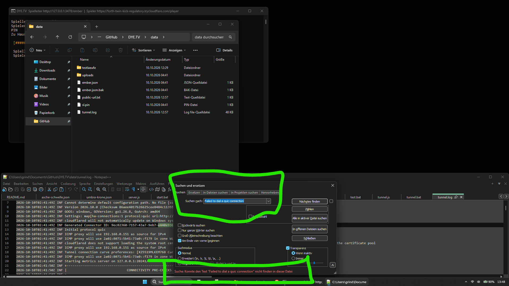

- Datei: `bilder/14_013-back-desktop-notepad-start-3-beweis.png` (Original: 013. BACK_DESKTOP - Notepad++ - Start 3 - Beweis.png)

### 15. 014. BACK_END - Notepad++ - Start 4 - Beweis.png

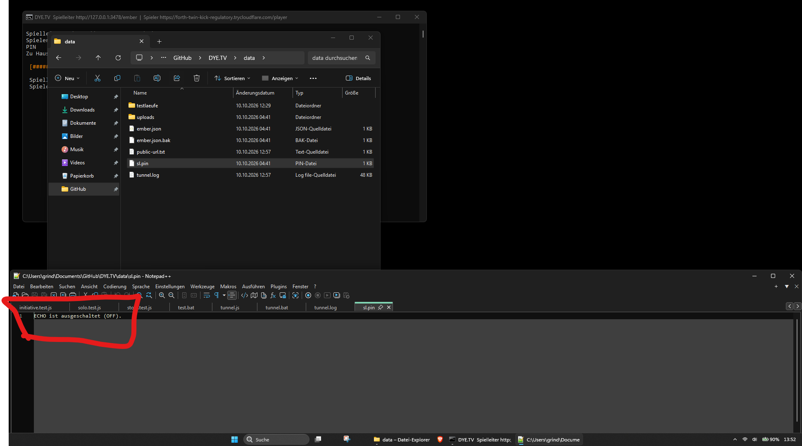

- Datei: `bilder/15_014-back-end-notepad-start-4-beweis.png` (Original: 014. BACK_END - Notepad++ - Start 4 - Beweis.png)

### 16. 015. FRONT_DESKTOP - Brave Browser - Bin auf Ember drauf.png

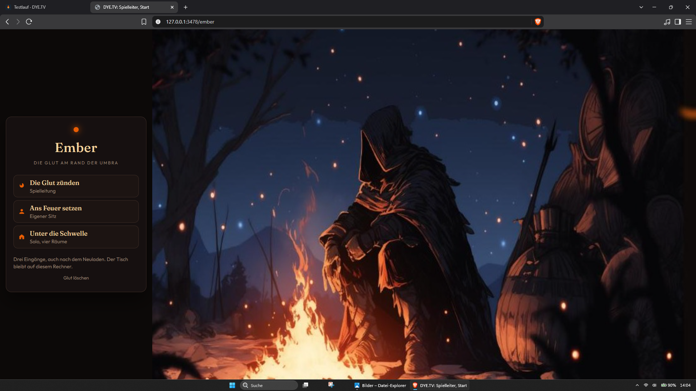

- Datei: `bilder/16_015-front-desktop-brave-browser-bin-auf.png` (Original: 015. FRONT_DESKTOP - Brave Browser - Bin auf Ember drauf.png)

### 17. 016. FRONT_DESKTOP - Brave Browser - Klick auf die glut entzünden.png

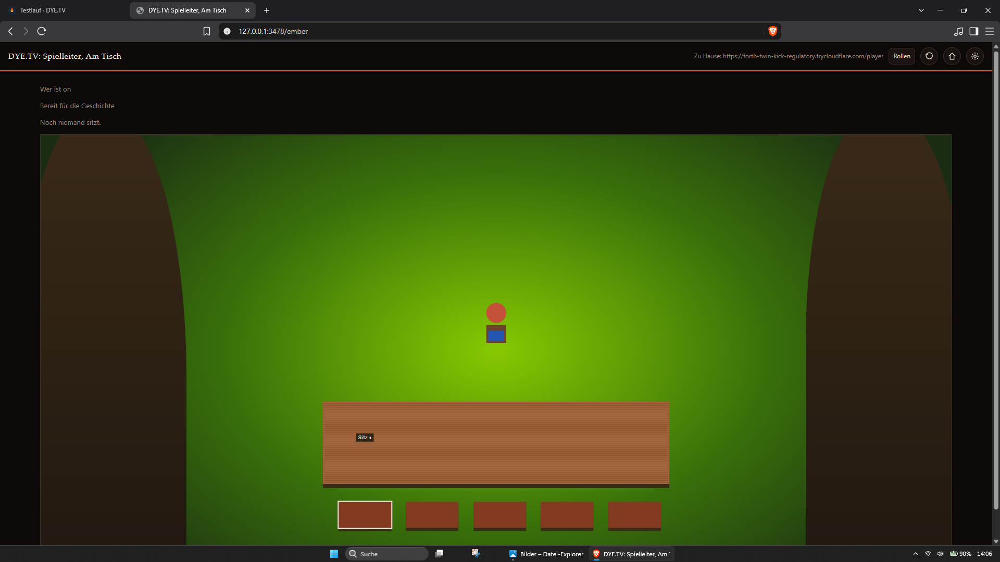

- Datei: `bilder/17_016-front-desktop-brave-browser-klick-au.png` (Original: 016. FRONT_DESKTOP - Brave Browser - Klick auf die glut entzünden.png)

### 18. 017. PLAYER_DESKTOP - Neu erstellt.png

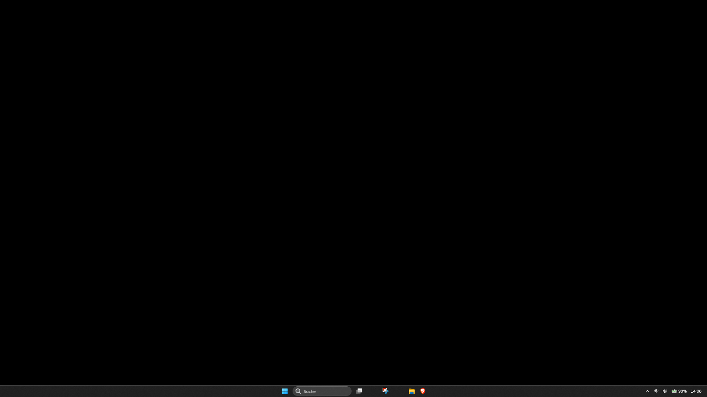

- Datei: `bilder/18_017-player-desktop-neu-erstellt.png` (Original: 017. PLAYER_DESKTOP - Neu erstellt.png)

### 19. 018. PLAYER_DESKTOP - Browser Brave - Selbes spielchen browser öffnen.png

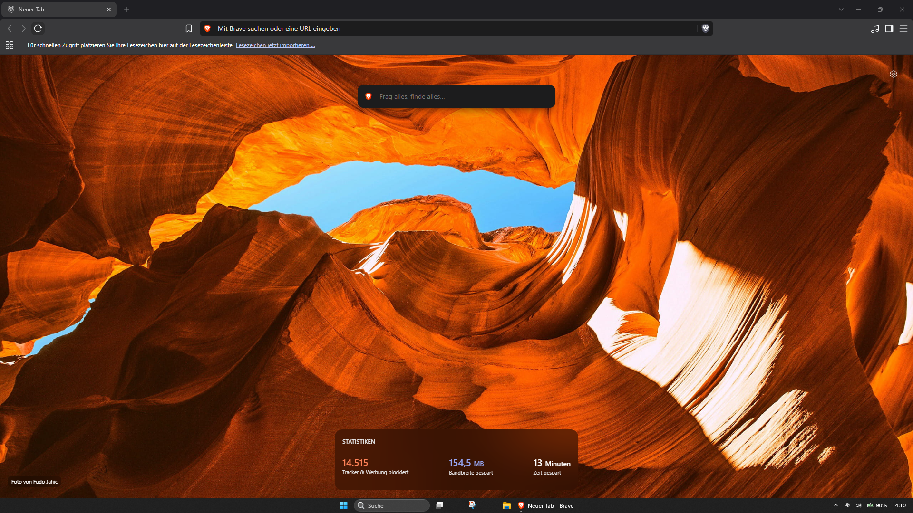

- Datei: `bilder/19_018-player-desktop-browser-brave-selbes.png` (Original: 018. PLAYER_DESKTOP - Browser Brave - Selbes spielchen browser öffnen.png)

### 20. 019. PLAYER_DESKTOP - Browser Brave - hab die die player URL.png

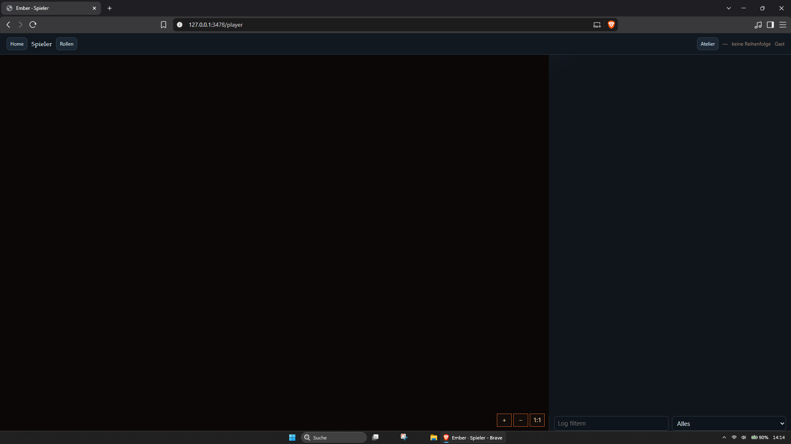

- Datei: `bilder/20_019-player-desktop-browser-brave-hab-die.png` (Original: 019. PLAYER_DESKTOP - Browser Brave - hab die die player URL.png)

### 21. 020. FRONT_DESKTOP - Brave Browser - Testlauf lief erstaunlich rund und bröchte erstmal keine verbesserung.png

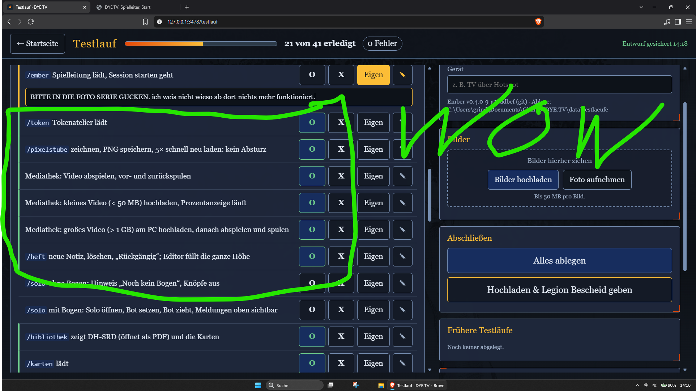

- Datei: `bilder/21_020-front-desktop-brave-browser-testlauf.png` (Original: 020. FRONT_DESKTOP - Brave Browser - Testlauf lief erstaunlich rund und bröchte erstmal keine verbesserung.png)

### 22. 021. FRONT_DESKTOP - Brave Browser - konnte von Ember per klick hier hin.png

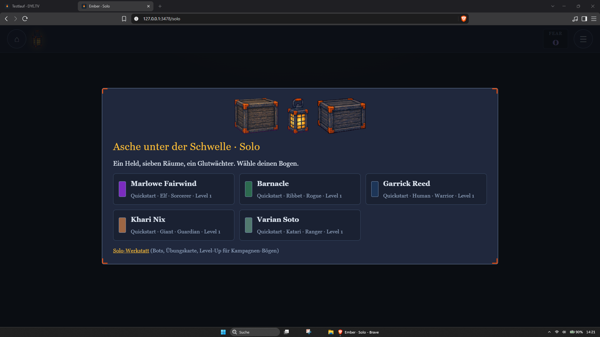

- Datei: `bilder/22_021-front-desktop-brave-browser-konnte-v.png` (Original: 021. FRONT_DESKTOP - Brave Browser - konnte von Ember per klick hier hin.png)

### 23. 022. FRONT_DESKTOP - Brave Browser - Solo laüft aber keiner greift zurück an.png

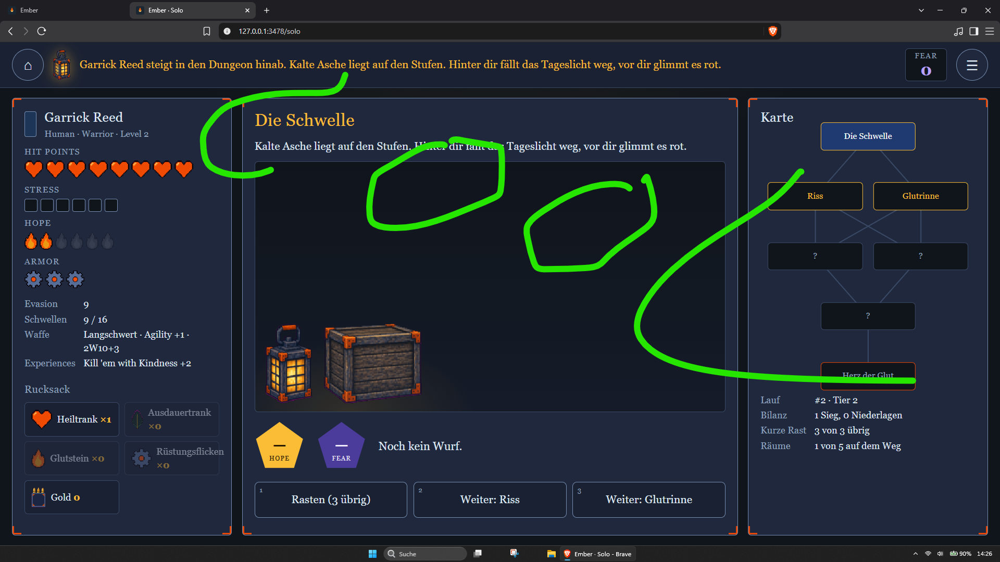

- Datei: `bilder/23_022-front-desktop-brave-browser-solo-lau.png` (Original: 022. FRONT_DESKTOP - Brave Browser - Solo laüft aber keiner greift zurück an.png)
