# Testlauf 10.10.2026, 20:13 Uhr

- Datum: 10.10.2026, 20:13 Uhr
- Tester: Dave
- Gerät: LAPTOP
- Ember-Version: v0.4.0-12-gb06b8a2 (git)

## Zusammenfassung

- 33 von 33 erledigt, 0 offen
- O (ok): 18 · X (Fehler): 3 · Eigen: 12
- Zeit gemessen: 20:45 (an 33 von 33 Punkten)
- Bilder: 25

## Fehler auf einen Blick

- Karte und Medien: Am Laptop unter „Boden“ eine andere Karte gewählt: TV und Handy zeigen sie.
- Karte und Medien: Am Laptop mit dem Werkzeug „Ping“ auf die Karte getippt: der Ping erscheint am TV und am Handy.
- Handy gesperrt und zurück: Nach dem Entsperren sitzt der Freund noch an seinem Bogen, ohne neu einzutreten. — muss neu einträten.

## Start am Laptop (02:37)

- [Eigen] `start.bat` gestartet, `http://127.0.0.1:3478/ember` lädt am Laptop nach ______ s. · ⏱ 00:39 — Notiz: Der punkt kann raus denke ich. der laptop hat genug power um noch viel mehr zu zeigen.
- [Eigen] Die Titelleiste des Konsolenfensters zeigt nach ______ s eine neue Adresse `https://….trycloudflare.com/player`. · ⏱ 01:13 — Notiz: 4 -5 sek im schnitt. ich glaube der punkt ist auch fertig und kann erstmal raus.
- [O] Die Startseite `/` zeigt in der Leitstelle beim Tunnel „an“ und unter dem Spieler-QR „Spieler über den Tunnel“. · ⏱ 00:45
- [O] In `/ember` die Session gestartet, die Karte ist am Laptop zu sehen. · ⏱ 00:01

## Handy des Freundes (mobile Daten) (03:59)

- [Eigen] Am Handy ist WLAN aus, es läuft nur über mobile Daten. · ⏱ 00:22 — Notiz: der punkt ist obsolet dank der Test umgebung selbst.
- [O] Der Freund scannt den Spieler-QR auf der Startseite (oder bekommt die Tunnel-Adresse aus „Adressen zum Kopieren“ per Messenger) und `/player` lädt nach ______ s. · ⏱ 00:48
- [Eigen] Am Handy ein Profil mit Name und PIN angelegt, Meldung „sitzt“ erscheint. · ⏱ 00:20 — Notiz: Er hat Test mit pw: 1111 erstellen können
- [Eigen] Am Laptop in `/ember` unter Einstellungen den Bogen dem Profil gemerkt, nach „Eintreten“ am Handy ist der Bogen wählbar. · ⏱ 00:31 — Notiz: weil keine bögen angezeigt wurden ist er auf ira gegangen. Screenshot enthalten.
- [O] Am Handy hochkant: Ready, Want Spotlight, Frage und Würfeln sind sichtbar und nicht von der Karte verdeckt. · ⏱ 01:48
- [Eigen] Beim Tippen ins Feld „Frage“ zoomt das Handy nicht in die Seite hinein. · ⏱ 00:09 — Notiz: Füllt sich an als ob mein Finger bei berührung die Karte "festhält" und man kan navigieren.

## TV (4K) (01:09)

- [Eigen] Am TV `http://<Laptop-IP>:3478/player` geöffnet und „Als Gast (Karte + Video)“ gewählt, die Karte ist zu sehen. · ⏱ 00:55 — Notiz: SAME as LAPTOP läuft.
- [O] Die Schrift am TV ist vom Sofa aus lesbar (sonst Browser-Zoom am TV notieren: ______ %). · ⏱ 00:12
- [Eigen] Mit dem Zeiger der Fernbedienung lassen sich Knöpfe ohne Fehlklick treffen. · ⏱ 00:02 — Notiz: Da müssen wir vllt sache grösser machen.

## Live zwischen allen drei (02:00)

- [O] Am Laptop ein Token verschoben: TV und Handy zeigen die neue Stelle nach ______ s. · ⏱ 01:45
- [O] Am Handy das eigene Token verschoben: Laptop und TV zeigen die neue Stelle. · ⏱ 00:03
- [O] Am Handy einen Hope-Punkt angetippt: der Laptop zeigt den neuen Wert. · ⏱ 00:04
- [Eigen] Der Sitz-Punkt des Freundes ist am Laptop grün, solange `/player` am Handy offen ist. · ⏱ 00:08 — Notiz: ist das normal das am LAPTOP die einzige verzögerte reaction ist. häufig 3-4 Sek

## Würfeln (01:29)

- [O] Am Handy „Würfeln“ getippt: das Ergebnis steht am Handy und nach ______ s im Log am Laptop. · ⏱ 01:11
- [O] Am Handy „Echte Würfel“ mit Hope- und Fear-Wert getippt: der Laptop zeigt genau diese Werte. · ⏱ 00:03
- [O] Am Handy zweimal schnell auf „Würfeln“ getippt: im Log steht nur ein Wurf. · ⏱ 00:09
- [O] Am Handy „Want Spotlight“ mit einer Frage getippt: der Laptop zeigt die Frage. · ⏱ 00:06

## Karte und Medien (05:32)

- [X] Am Laptop unter „Boden“ eine andere Karte gewählt: TV und Handy zeigen sie. · ⏱ 00:05
- [X] Am Laptop mit dem Werkzeug „Ping“ auf die Karte getippt: der Ping erscheint am TV und am Handy. · ⏱ 00:12
- [Eigen] Ein kurzes Video in der Mediathek hochgeladen: es steht am TV und am Handy in der Videoliste. · ⏱ 00:04 — Notiz: Kann auch erstmal raus. Klappte immer ohne wenn und aber.
- [Eigen] Das Video am TV abgespielt, vor- und zurückgespult, der Ton kommt. · ⏱ 00:35 — Notiz: beim zurückspulen kommt es manchmal vor das er sein audio verliert. aber kaum neugeladen läufts.
- [O] Das Video am Handy über mobile Daten gestartet, es läuft nach ______ s. · ⏱ 04:37 — Notiz: ok ich sage dir das nur weil ich glaube rechtliche probleme bekommen kann?! hab extra einen Conan Film gekauft. Digitalisiert. als MP4 Convertiert. Reingeladen. Freund gefragt was er von dem Film hält. Er fand ihn klasse.

## Handy gesperrt und zurück (01:39)

- [Eigen] Handy 1 Minute gesperrt, währenddessen am Laptop ein Token bewegt: nach dem Entsperren zeigt `/player` die neue Stelle ohne Neuladen. · ⏱ 00:16 — Notiz: Ja aber die Seite "zuckte" kurz... bin also nicht ganz sicher.
- [X] Nach dem Entsperren sitzt der Freund noch an seinem Bogen, ohne neu einzutreten. · ⏱ 00:45 — Notiz: muss neu einträten.
- [O] Der Hinweis „Verbindung weg, verbinde neu …“ ist nach dem Entsperren nach ______ s wieder weg. · ⏱ 00:15 — Notiz: 3-5 sek.
- [O] Handy 10 s in den Flugmodus und zurück: `/player` verbindet sich selbst wieder und Würfeln geht. · ⏱ 00:23

## Abschluss (02:19)

- [O] `data\crash.log` geprüft: leer / Einträge: ______ · ⏱ 01:33
- [O] Auf `/testlauf` im Kasten „Legion-Verbindung“ steht „Schlüssel gesetzt, Header Authorization“. · ⏱ 00:27 — Notiz: endlich klappt das.
- [O] „Hochladen & Legion Bescheid geben“ getippt: die Seite meldet „Hochgeladen“ und „Legion hat Bescheid bekommen.“ · ⏱ 00:20

## Notizen

Ich Hab so nach und nach wie vorher auch jeden click dokumentiert.
Von Start Testlauf bin ich über meine Mini Ansicht an Alles dran.
Ach und Hab irgend wie egal von Wo aus Solo ein paar Runden Gespielt Total Cool. Obwohl es wahrscheinlich nicht ganz "Intended" ist.

Die Richtung gefällt mir wohin hier Alles geht. 

Aber:
Wie erstellt man bessere/nicht dauerwiederholende Checklisten Punkte? - Gamification ist ein begriff über den ich gestolpert bin würde sowas gehen? Also Aus dem Testlauf heraus Player oder DM eingang wählen, Erdachter Plan verfolgen und so bald ich irgendwie nicht an den wichtigen Punkte ran komme. NOT STOP obem im Header von TESTLAUF drücken. es schmeist mich in den TEST und ich kann dir schreiben was war.

## Bilder

### 1. 000. BACK_DESKTOP - Fetch & Pull DONE.png .png

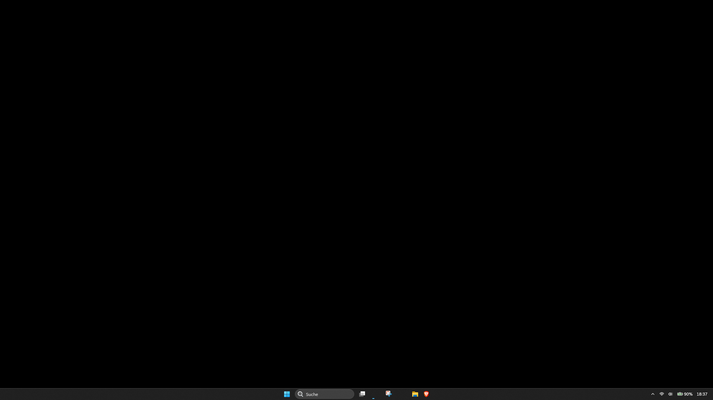

- Datei: `bilder/01_000-back-desktop-fetch-pull-done-png.png` (Original: 000. BACK_DESKTOP - Fetch & Pull DONE.png .png)

### 2. 001. BACK_DESKTOP - Explorer geöffnet .png

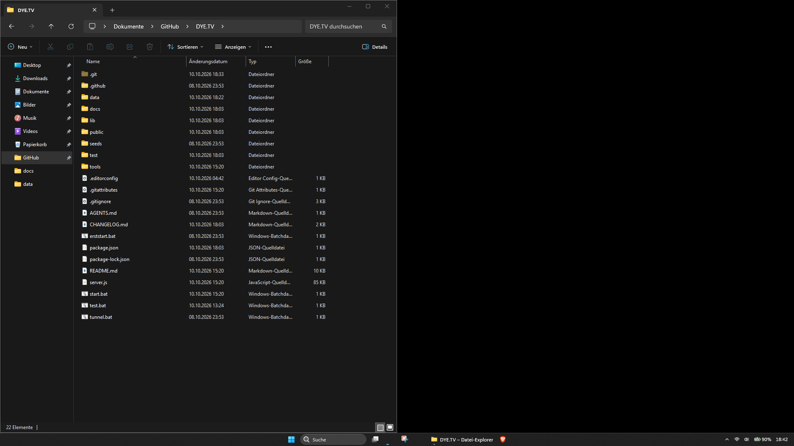

- Datei: `bilder/02_001-back-desktop-explorer-geoeffnet.png` (Original: 001. BACK_DESKTOP - Explorer geöffnet .png)

### 3. 002. BACK_DESKTOP - start.bat geöffnet .png

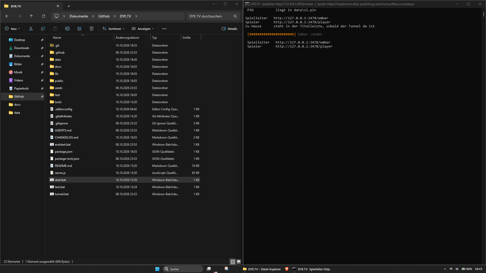

- Datei: `bilder/03_002-back-desktop-start-bat-geoeffnet.png` (Original: 002. BACK_DESKTOP - start.bat geöffnet .png)

### 4. 003. FRONT_DESKTOP -  wechsle zu FRONT_DESKTOP.png

- Datei: `bilder/04_003-front-desktop-wechsle-zu-front-deskt.png` (Original: 003. FRONT_DESKTOP - wechsle zu FRONT_DESKTOP.png)

### 5. 004. FRONT_DESKTOP -  Brave geöffnet.png

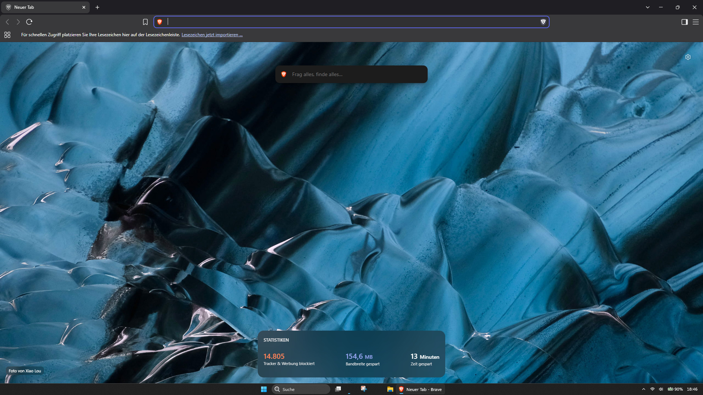

- Datei: `bilder/05_004-front-desktop-brave-geoeffnet.png` (Original: 004. FRONT_DESKTOP - Brave geöffnet.png)

### 6. 005. FRONT_DESKTOP - öffne gezeigte URL.png

- Datei: `bilder/06_005-front-desktop-oeffne-gezeigte-url.png` (Original: 005. FRONT_DESKTOP - öffne gezeigte URL.png)

### 7. 006. PLAYER_DESKTOP -welchsle zu PLAYER_DESKTOP.png

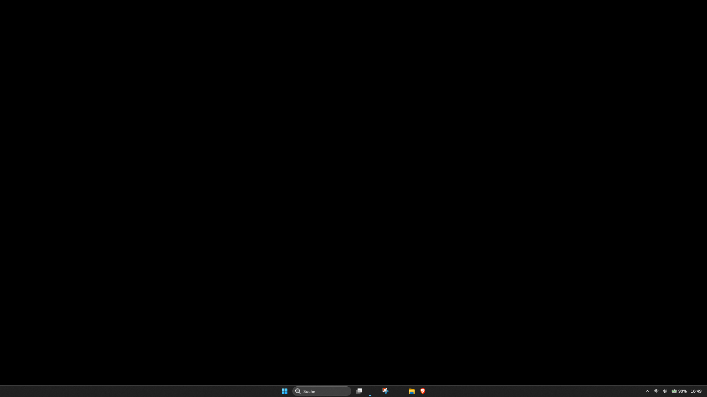

- Datei: `bilder/07_006-player-desktop-welchsle-zu-player-de.png` (Original: 006. PLAYER_DESKTOP -welchsle zu PLAYER_DESKTOP.png)

### 8. 007. PLAYER_DESKTOP - Brave geöffnet.png

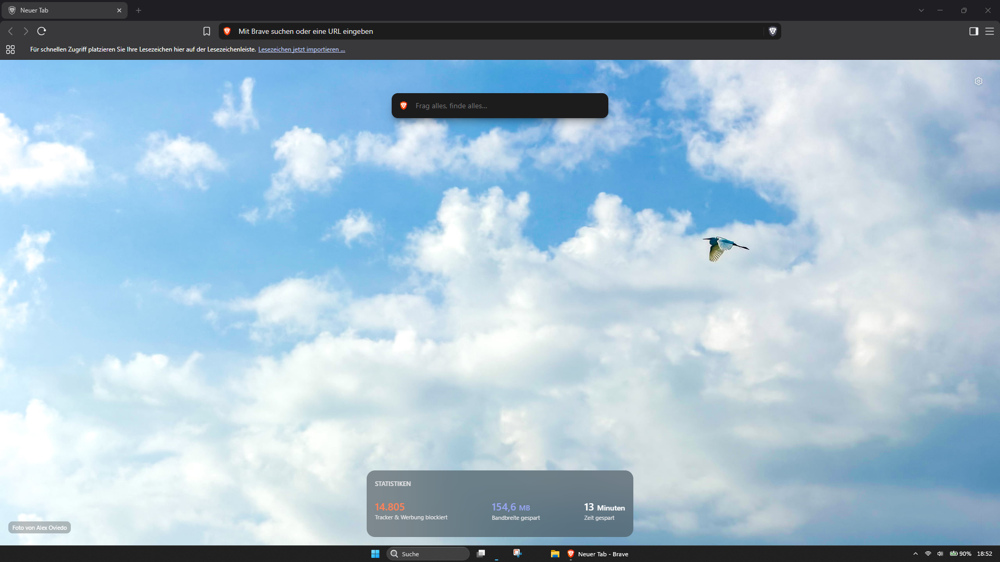

- Datei: `bilder/08_007-player-desktop-brave-geoeffnet.png` (Original: 007. PLAYER_DESKTOP - Brave geöffnet.png)

### 9. 007. PLAYER_DESKTOP - öffne gezeigte URL.png

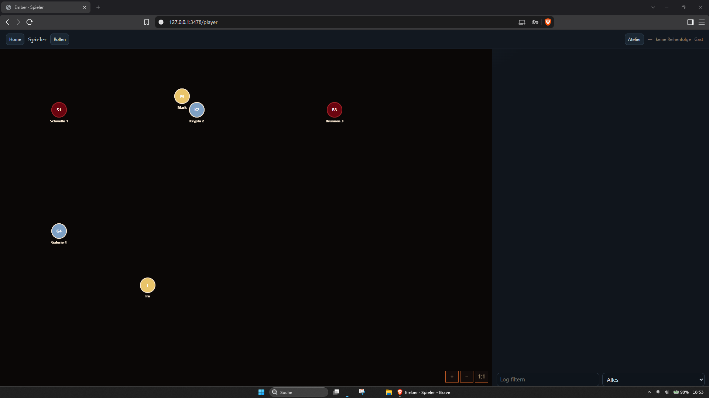

- Datei: `bilder/09_007-player-desktop-oeffne-gezeigte-url.png` (Original: 007. PLAYER_DESKTOP - öffne gezeigte URL.png)

### 10. 008. DM_DESKTOP - wechsle zu DM_DESKTOP.png

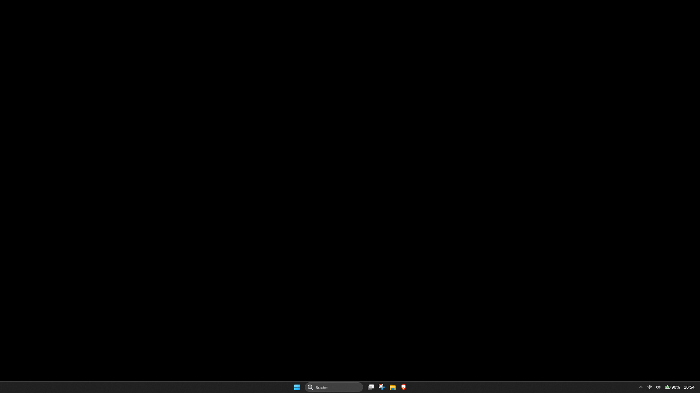

- Datei: `bilder/10_008-dm-desktop-wechsle-zu-dm-desktop.png` (Original: 008. DM_DESKTOP - wechsle zu DM_DESKTOP.png)

### 11. 009. DM_DESKTOP - Brave geöffnet.png

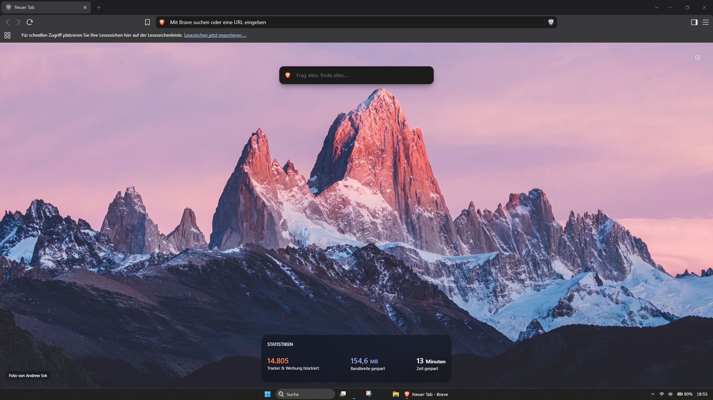

- Datei: `bilder/11_009-dm-desktop-brave-geoeffnet.png` (Original: 009. DM_DESKTOP - Brave geöffnet.png)

### 12. 010. DM_DESKTOP - öffne gezeigte URL.png

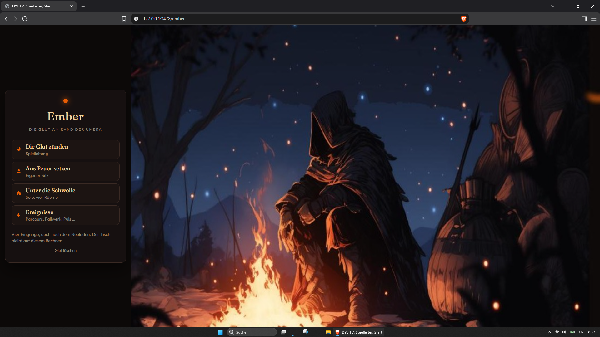

- Datei: `bilder/12_010-dm-desktop-oeffne-gezeigte-url.png` (Original: 010. DM_DESKTOP - öffne gezeigte URL.png)

### 13. 011.  LAPTOP - Zwischenstand .jpg

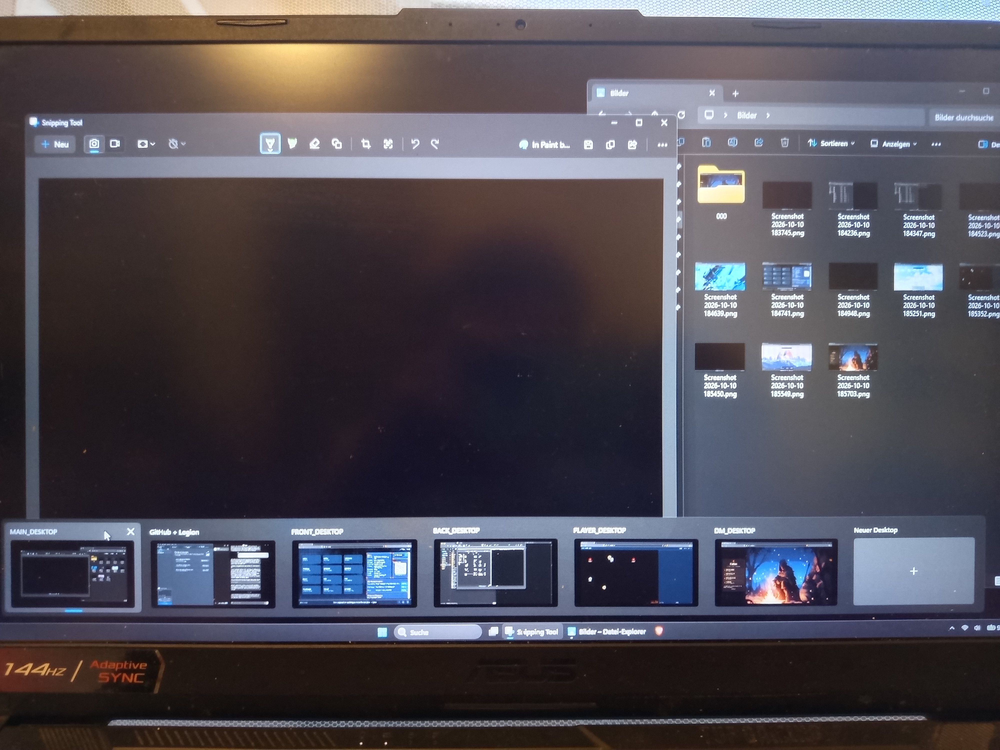

- Datei: `bilder/13_011-laptop-zwischenstand.jpg` (Original: 011. LAPTOP - Zwischenstand .jpg)

### 14. 012. FRONT_DESKTOP - wechsle zu FRRONT_DESKTOP.png

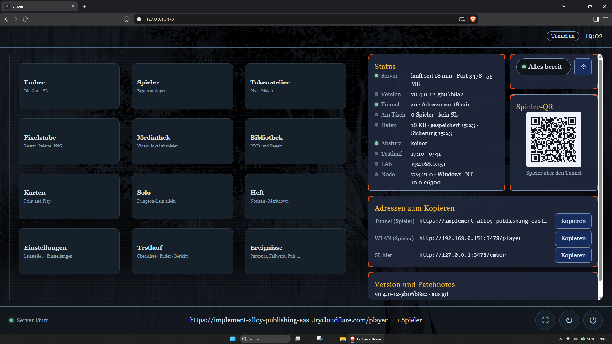

- Datei: `bilder/14_012-front-desktop-wechsle-zu-frront-desk.png` (Original: 012. FRONT_DESKTOP - wechsle zu FRRONT_DESKTOP.png)

### 15. 013. FRONT_DESKTOP - click auf Testlauf.png

- Datei: `bilder/15_013-front-desktop-click-auf-testlauf.png` (Original: 013. FRONT_DESKTOP - click auf Testlauf.png)

### 16. 014. RedMI_13 - Nach Neustart.jpg

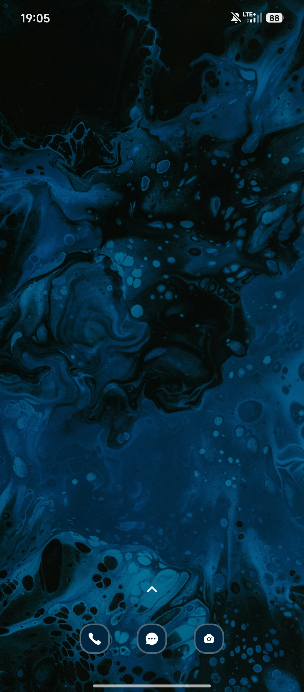

- Datei: `bilder/16_014-redmi-13-nach-neustart.jpg` (Original: 014. RedMI_13 - Nach Neustart.jpg)

### 17. 015. RedMI_13 - Brave geöffnet.jpg

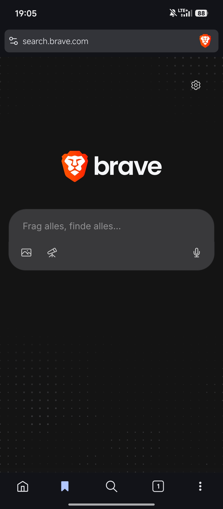

- Datei: `bilder/17_015-redmi-13-brave-geoeffnet.jpg` (Original: 015. RedMI_13 - Brave geöffnet.jpg)

### 18. 016. RedMI_13 - Nach Scan von QR-Code.jpg

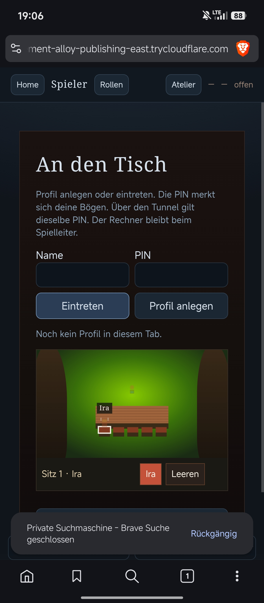

- Datei: `bilder/18_016-redmi-13-nach-scan-von-qr-code.jpg` (Original: 016. RedMI_13 - Nach Scan von QR-Code.jpg)

### 19. 017. PLAYER_DESKTOP - öffne 2ten TAB.png

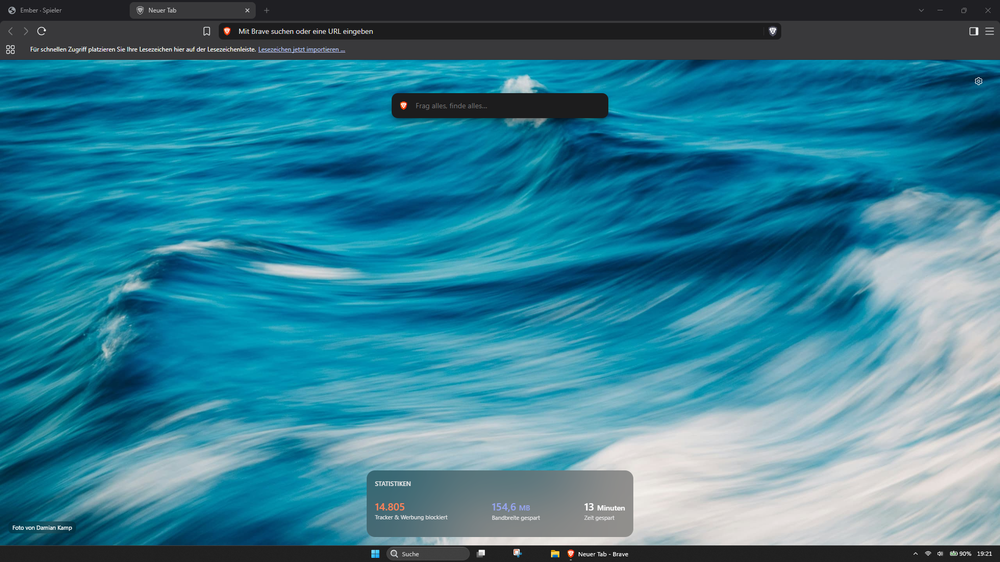

- Datei: `bilder/19_017-player-desktop-oeffne-2ten-tab.png` (Original: 017. PLAYER_DESKTOP - öffne 2ten TAB.png)

### 20. 017. PLAYER_DESKTOP - wechsle zu PLAYER_DESKTOP.png

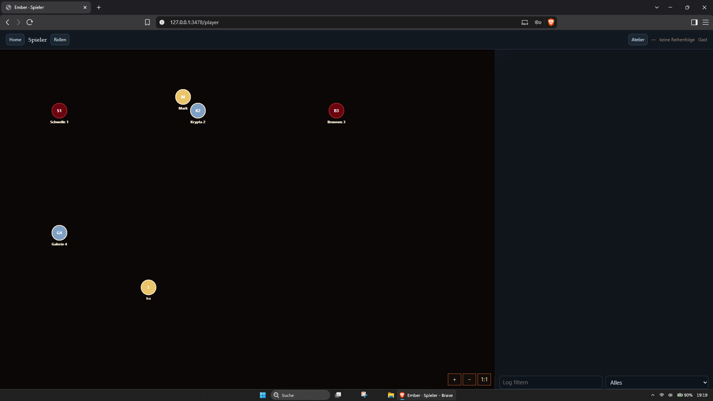

- Datei: `bilder/20_017-player-desktop-wechsle-zu-player-des.png` (Original: 017. PLAYER_DESKTOP - wechsle zu PLAYER_DESKTOP.png)

### 21. 018. PLAYER_DESKTOP - öffne gezeigte URL.png

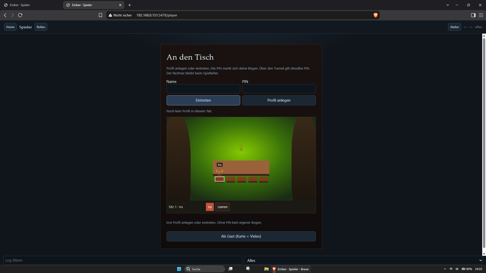

- Datei: `bilder/21_018-player-desktop-oeffne-gezeigte-url.png` (Original: 018. PLAYER_DESKTOP - öffne gezeigte URL.png)

### 22. 019. LAPTOP - Zwischenstand.jpg

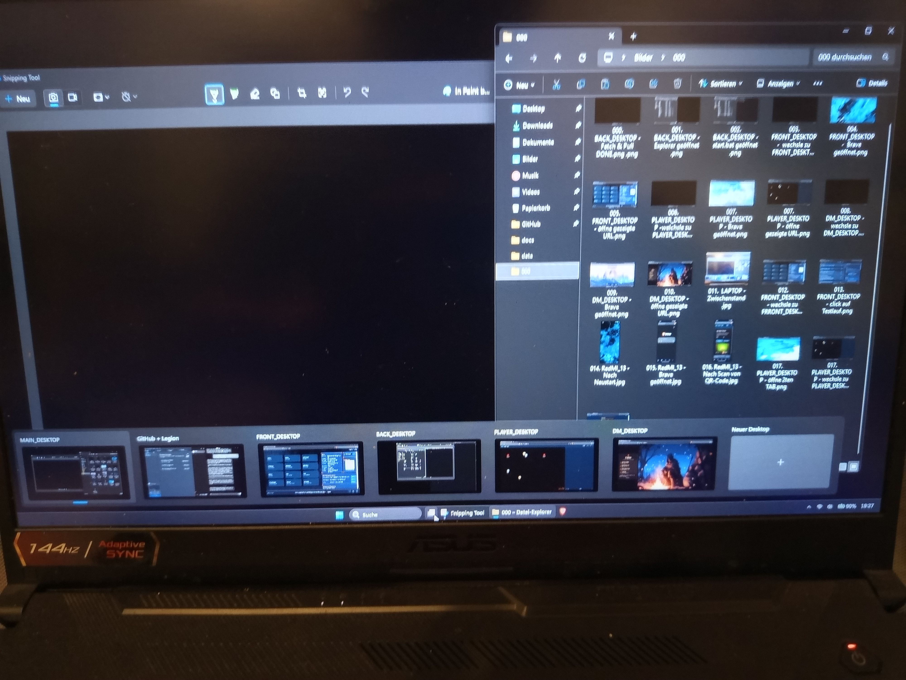

- Datei: `bilder/22_019-laptop-zwischenstand.jpg` (Original: 019. LAPTOP - Zwischenstand.jpg)

### 23. 020. FRONT_DESKTOP - wechsle zu FRRONT_DESKTOP.png

- Datei: `bilder/23_020-front-desktop-wechsle-zu-frront-desk.png` (Original: 020. FRONT_DESKTOP - wechsle zu FRRONT_DESKTOP.png)

### 24. 021. FRONT_DESKTOP - click auf Testlauf.png

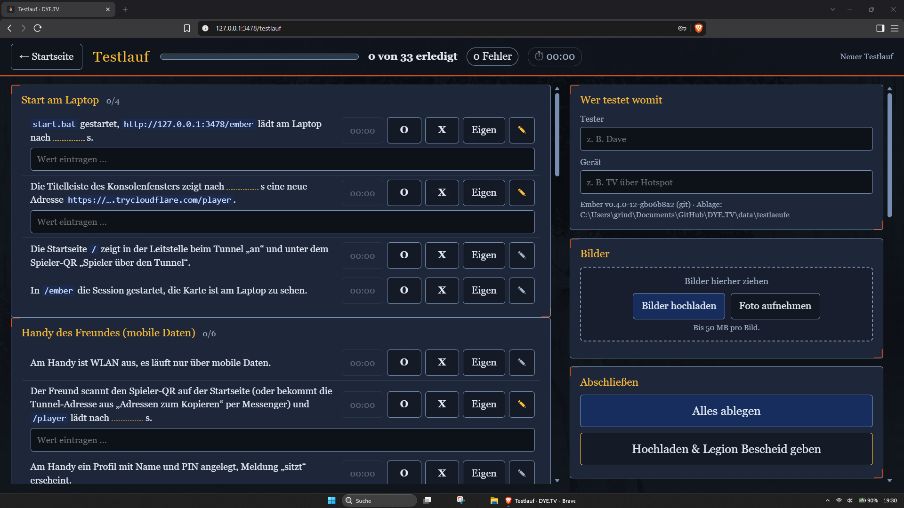

- Datei: `bilder/24_021-front-desktop-click-auf-testlauf.png` (Original: 021. FRONT_DESKTOP - click auf Testlauf.png)

### 25. 022. FRONT_DESKTOP - Ende vom Testlauf.png

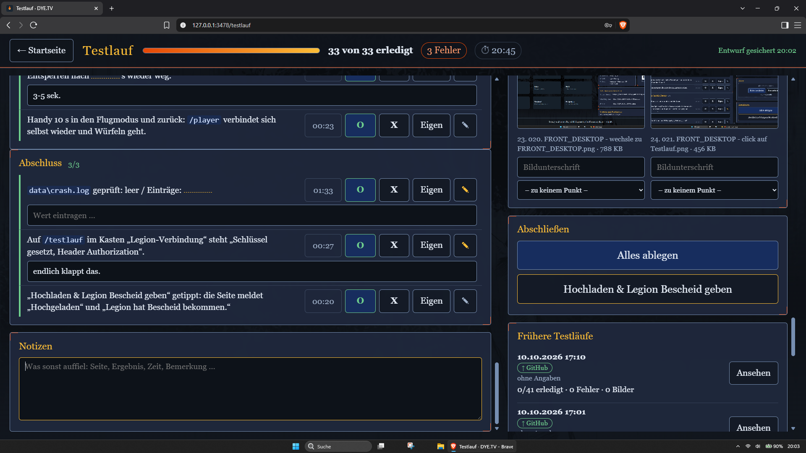

- Datei: `bilder/25_022-front-desktop-ende-vom-testlauf.png` (Original: 022. FRONT_DESKTOP - Ende vom Testlauf.png)
